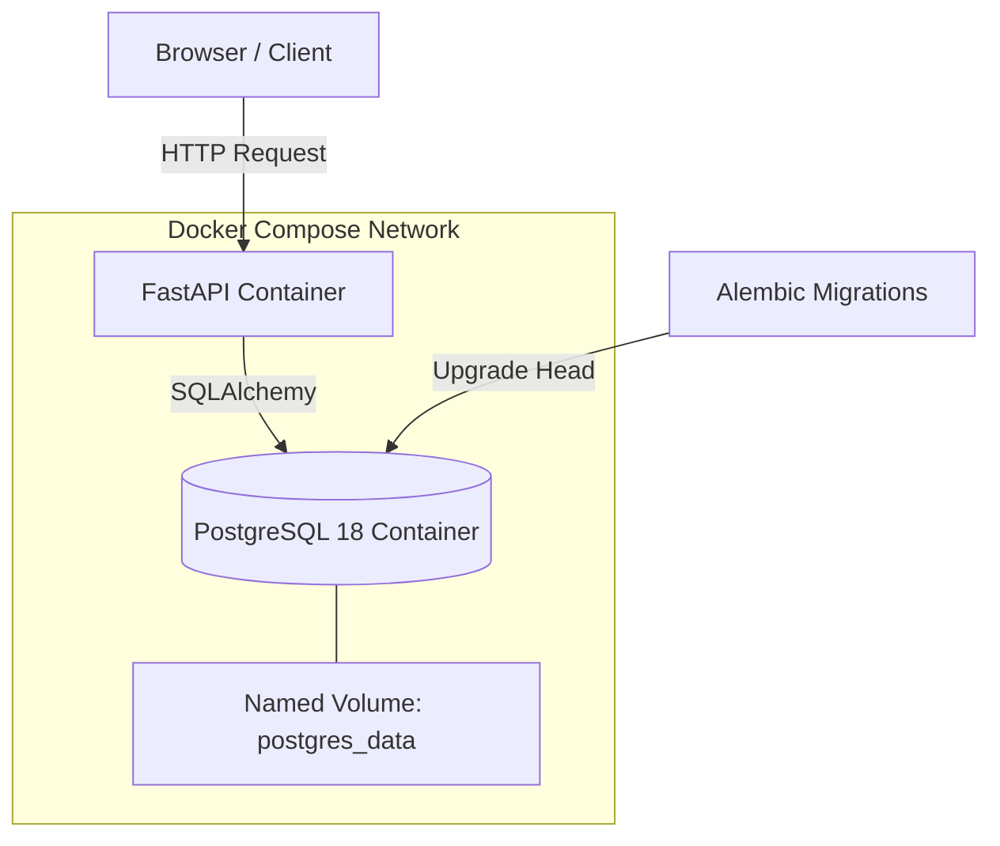

<div align="center">
  <h1>🚀 AutoDeploy Taskflow</h1>
  <p><strong>A Modern, Containerized Task Management API with GitHub Actions CI/CD</strong></p>

  [](https://python.org)
  [](https://fastapi.tiangolo.com)
  [](https://postgresql.org)
  [](https://docker.com)
  [](https://github.com/features/actions)
</div>

<hr>

## 📋 Project Overview

**AutoDeploy** is a full-stack Task Management application built as a DevOps-focused portfolio project. It demonstrates how to build, test, migrate, containerize, and continuously integrate a Python API with PostgreSQL using Docker and GitHub Actions.

### 🌟 Key Features
- **FastAPI Backend:** High-performance async API with Pydantic data validation.
- **PostgreSQL Database:** Robust relational data storage using SQLAlchemy ORM.
- **Alembic Migrations:** Safe, version-controlled database schema management.
- **Glassmorphism UI:** A sleek, vanilla JS/HTML/CSS frontend for managing tasks.
- **Dockerized:** Fully containerized development environment using Docker Compose.
- **Continuous Integration (CI):** Automated `pytest` execution via GitHub Actions.
- **Automated Docker Publishing (CD):** Automatic image builds and pushes to GitHub Container Registry (GHCR) upon successful CI.

---

## 🏗️ Architecture



---

## 🚀 Getting Started Locally

### 1. Prerequisites
- Docker and Docker Compose installed.
- Git installed.

### 2. Setup the Environment
Clone the repository and set up your environment variables:
```bash
git clone https://github.com/yourusername/autoDeploy.git
cd autoDeploy
cp .env.example .env
```
*(Note: Modify `.env` with your secure database credentials if desired, though the defaults work out-of-the-box for local testing).*

### 3. Spin Up the Environment
Start the application and database in the background:
```bash
docker compose up -d
```
Docker Compose will automatically:
1. Start the PostgreSQL database.
2. Wait for the database healthcheck to pass.
3. Run Alembic migrations to construct the schema.
4. Boot up the FastAPI web server.

### 4. Access the Application
- **Frontend UI:** [http://localhost:8000](http://localhost:8000)
- **API Interactive Docs (Swagger):** [http://localhost:8000/docs](http://localhost:8000/docs)

---

## 🛠️ Useful Docker Commands

```bash
# View running containers
docker compose ps

# View live application logs
docker compose logs -f api

# Stop the application (preserves database data)
docker compose down

# Rebuild the API image manually
docker build -t autodeploy-api:test .

# Connect directly to the PostgreSQL database shell
docker compose exec db psql -U autodeploy -d autodeploy
```

---

## 🧪 Testing

The project uses `pytest` with an isolated, in-memory SQLite database to ensure tests are fast, clean, and do not mutate your local PostgreSQL data.

To run the test suite locally inside the Docker container:
```bash
docker compose exec api pytest
```

---

## ⚙️ Continuous Integration (CI)

This project strictly enforces **Phase 4 CI** quality gates using GitHub Actions.

Whenever code is pushed to the `main` branch or a Pull Request is opened:
1. GitHub Actions checks out the code.
2. Sets up Python 3.12 and installs `requirements.txt`.
3. Runs the `pytest` suite.
4. If **any** test fails, the pipeline immediately halts and marks the commit as failed.

---

## 📦 Docker Image Publishing (GHCR)

This project implements **Phase 5 CD** automated publishing.

After a **successful** CI Test run on the `main` branch:
1. A separate GitHub Action (`docker-publish.yml`) is triggered.
2. It authenticates securely to the GitHub Container Registry (`ghcr.io`) using the temporary `GITHUB_TOKEN`.
3. It builds the Docker image and tags it with the exact Git commit SHA for full traceability (e.g., `ghcr.io/owner/repo:sha-8f31c92`).
4. The image is published as a Package attached to your GitHub repository.

### CI/CD Workflow Architecture

```text
Developer
    |
    | git push main
    v
GitHub
    |
    v
CI Test (pytest)
    |
    +---- FAIL ----> STOP (No image published)
    |
    v
PASS
    |
    v
Docker Build
    |
    v
GHCR
    |
    v
Published Docker Image
```

---

<div align="center">
  <i>Developed as a modern CI/CD DevOps Portfolio Project</i>
</div>
